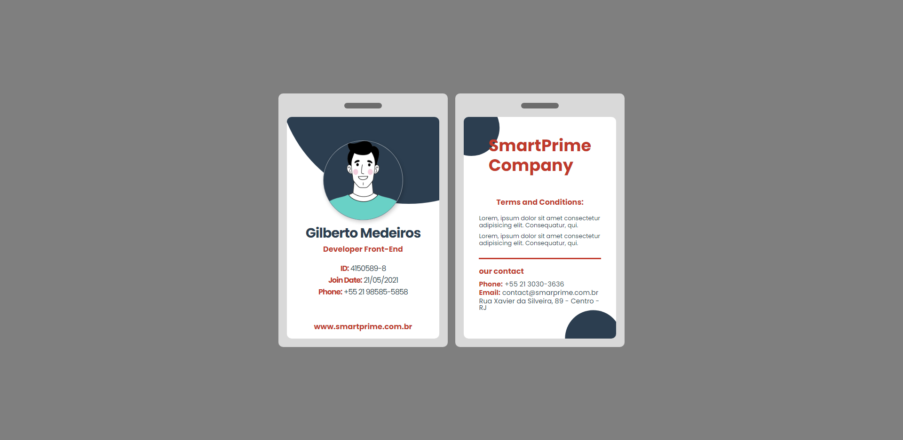

# cardBadge

<h1 align="center">
    Desenvolvimento de um crachá.
</h1>

<h3 align="center">
  Projeto elaborado para fim de estudo de HTML5 e CSS3..
</h3>

<blockquote align="center">“Querer vencer significa já ter percorrido metade do caminho.”</blockquote>

  
  

<h2>
  Desenvolvimento
</h2>

Desafios para fortalecer alguns conceitos, entre eles:

- **HTML5**;
- **CSS3**;

<h2>
  Visão do Projeto!
</h2>

  
  

<h2>
  Desktop e Mobile!
</h2>

Aqui estão listados alguns dos <strong>Breakpoints</strong> que foram testados no desenvolvimento:

- **467**;
- **576**;
- **768**;
- **992**;
- **1200**;
- **1400**.

<h2>
  Download do conteúdo!
</h2>

- Efetuar clone da aplicação;
- Abrir no navegador o projeto;

## :memo: Licença

Esse projeto está sob a licença MIT. Veja o arquivo [LICENSE](../LICENSE) para mais detalhes.
